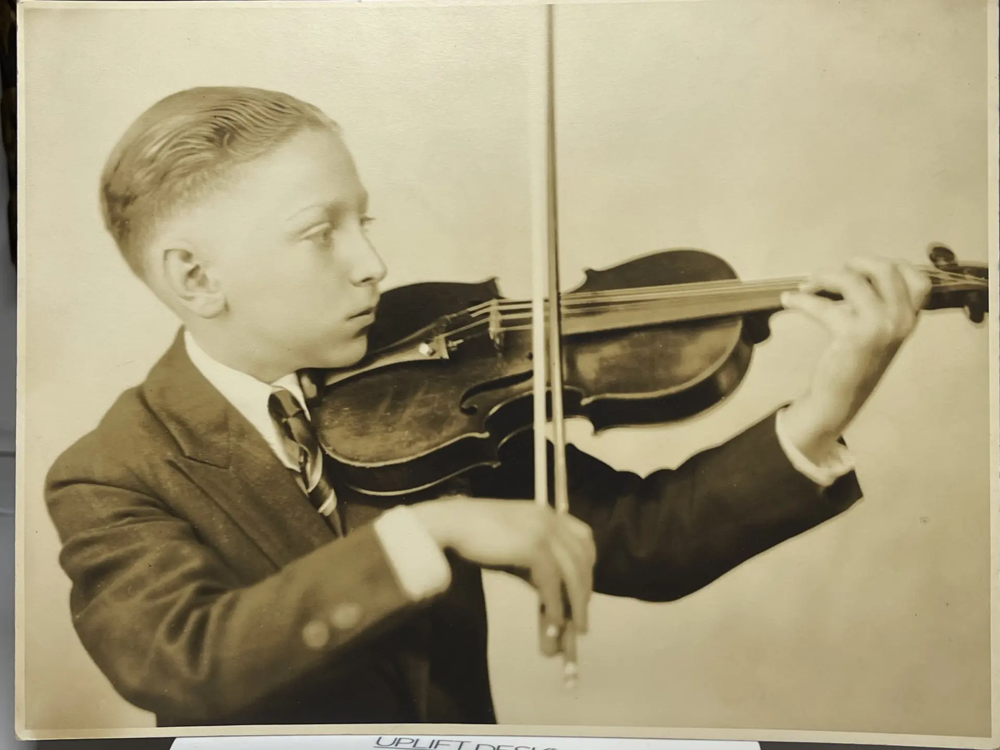
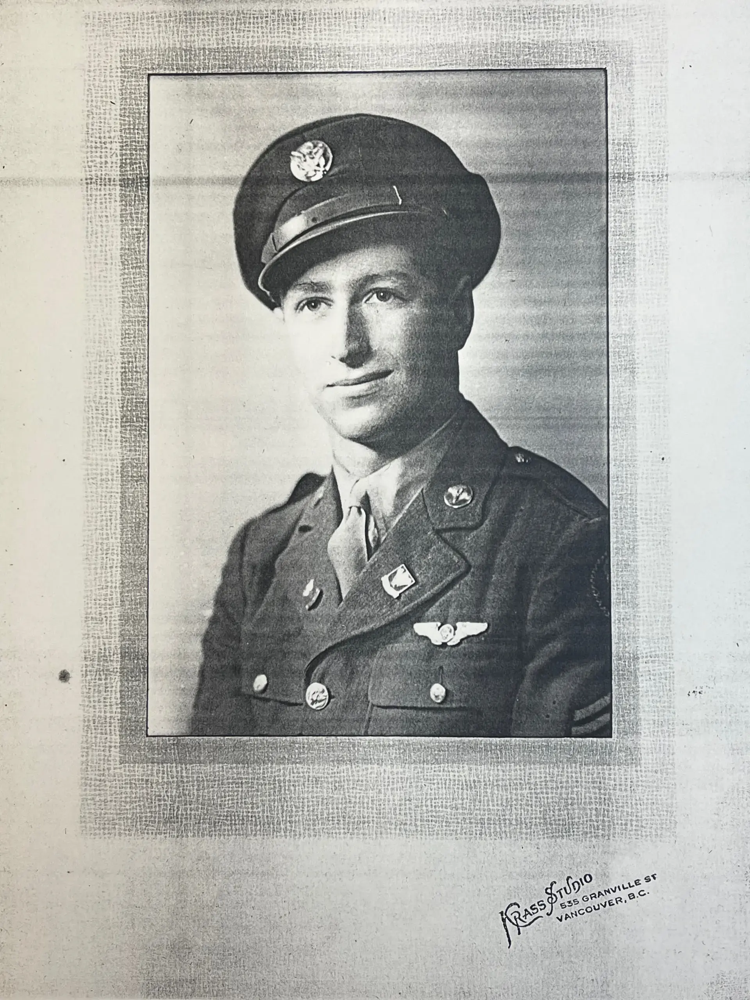
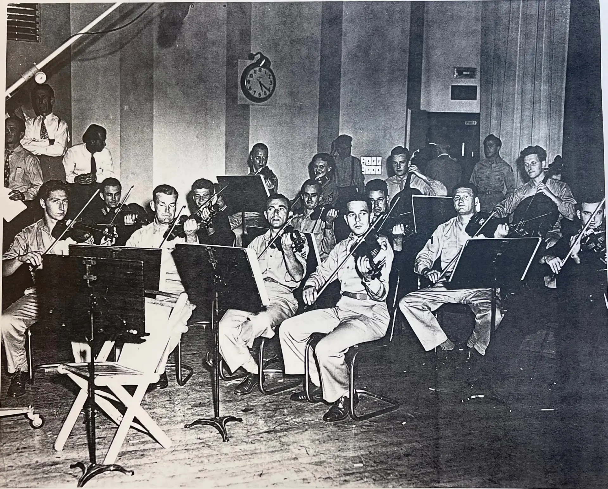
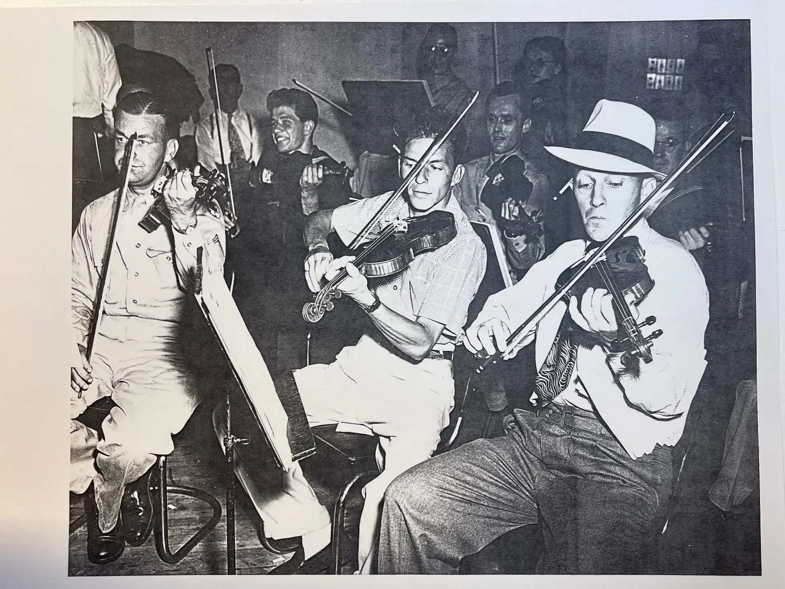
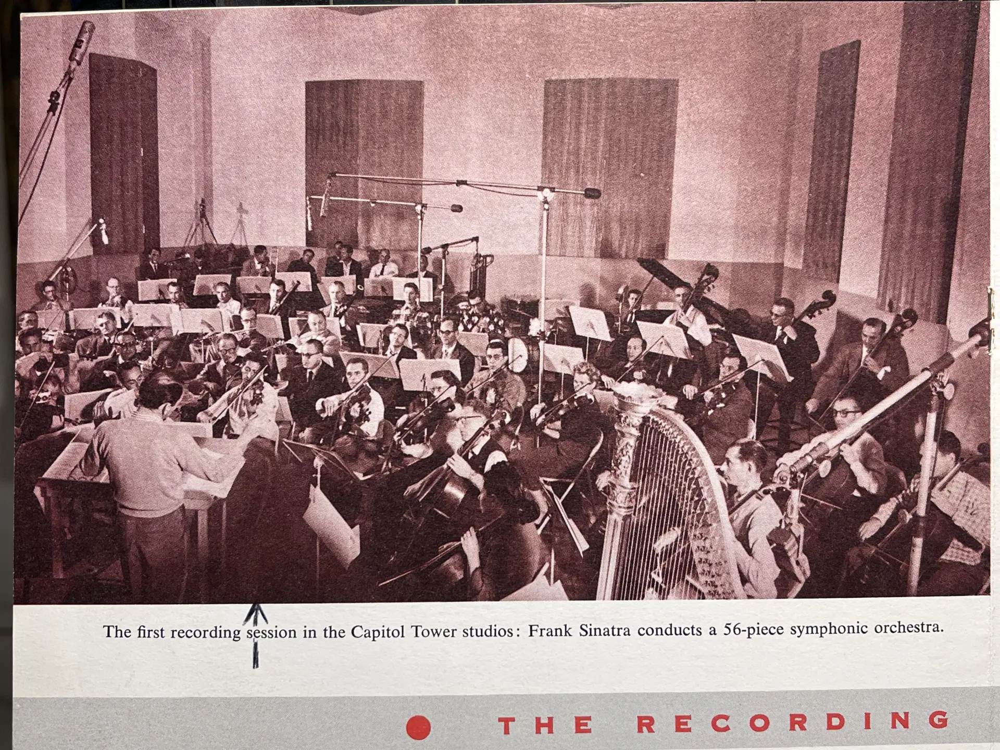
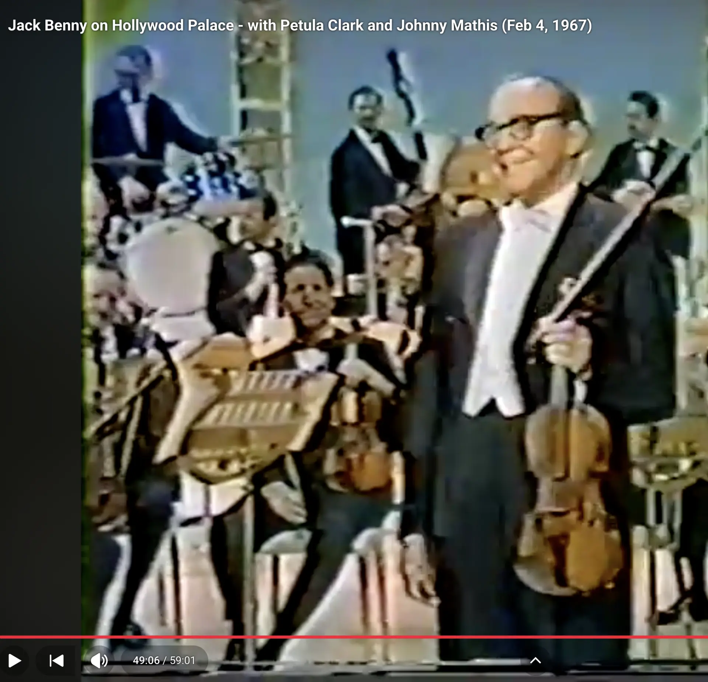
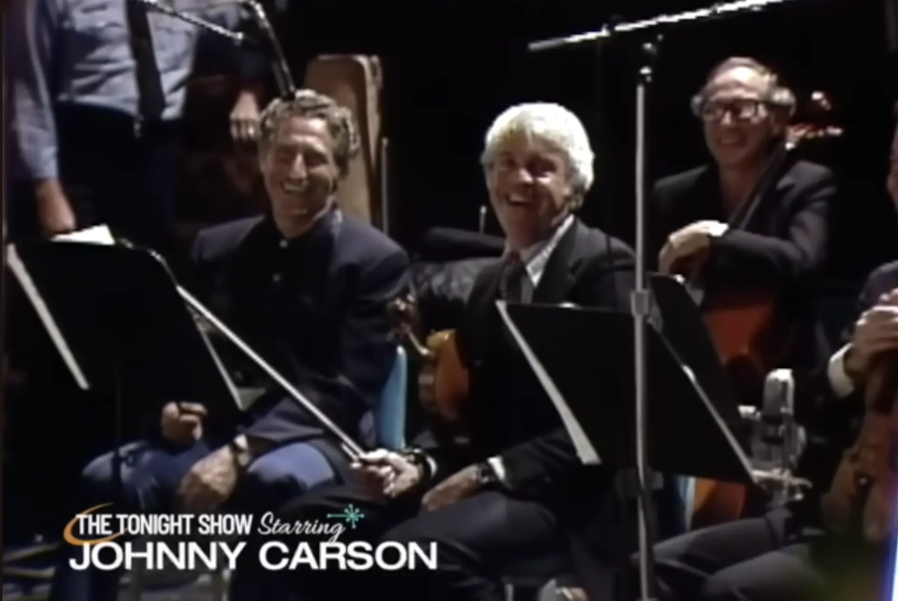
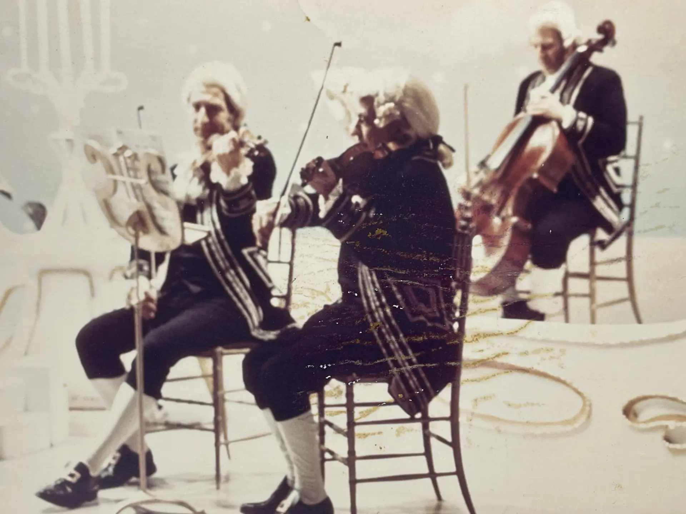
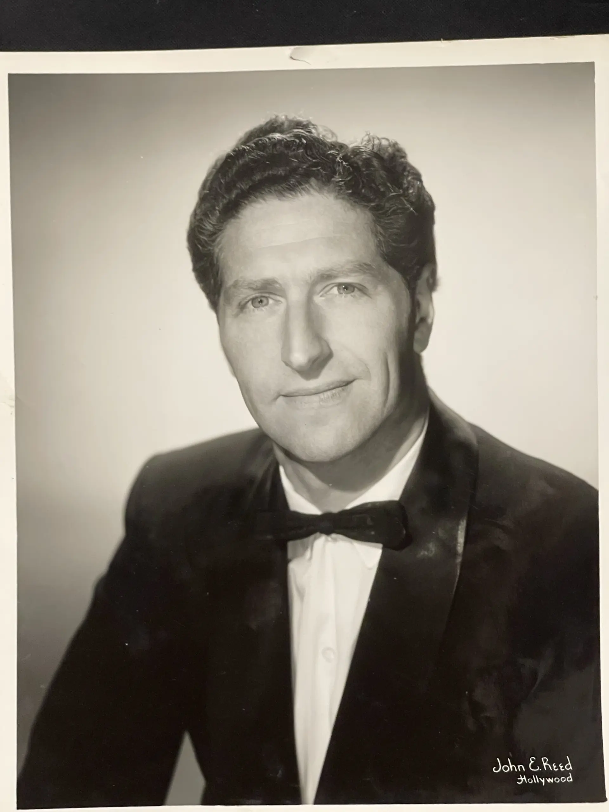
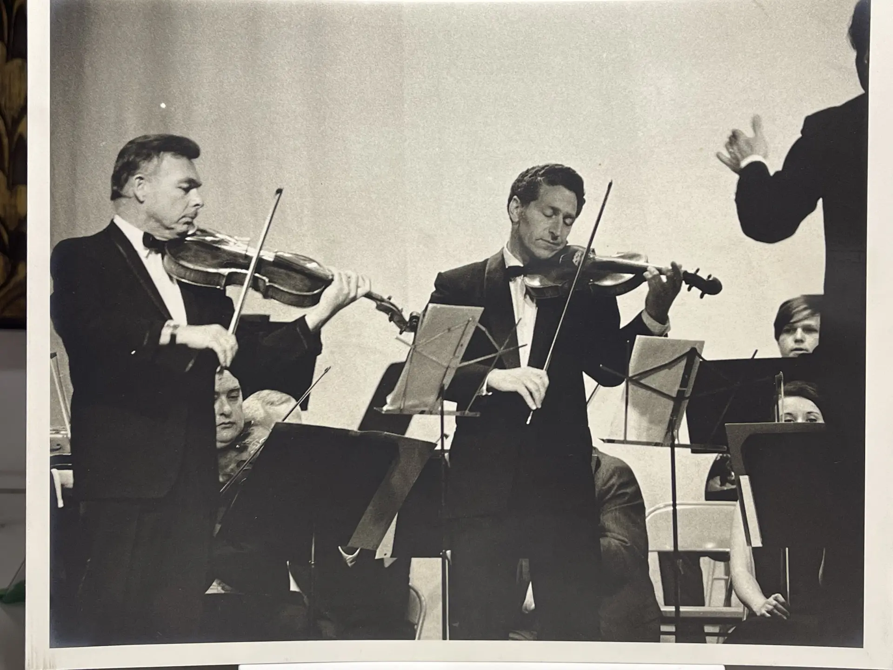

# Nathan Ross—My Dad

This is the story of my late father, Nathan Ross—born Nathan Rothstein, the son of immigrants who crossed the
ocean to settle in Canada. It is told through a chronology of the artifacts he left behind: an oil portrait hanging
in my office painted by his cousin Norman Pelman, a few photos, newspaper clippings, concert programs, diplomas,
an army discharge certificate, and a letter from a future President.

Piece by piece, these keepsakes trace a life that evolved from a child prodigy on a Vancouver stage, to a radio
operator and gunner aboard a B-17 flying 35 missions over Germany during World War II, to the concertmaster's
chair in Hollywood's studio orchestras, to ... well, my dad. 

---

## Little Nacy

Before he was "Nathan Ross" he was just little Nacy—the curly-haired boy propped up on the table on the left
of this Vancouver family portrait.

Family lore says that not long after this photo, his father, Max, spotted him strumming a rubber band stretched over
a ruler. Recognizing a kindred musical spark, Max took it as a sign and became his young son's first violin teacher.

---

## Violinist

This photo showcases the outward-facing role Nathan held the longest, and it serves as the focus for many
of the artifacts gathered here.

Nathan had already achieved remarkable mastery over his instrument by the time this portrait was taken.

He made his concert debut at just six years old at the British Columbia Musical Festival, winning first
prize for the most talented child under ten. 

Four years after that first victory, the same festival named Nathan its most talented competitor under nineteen.

By fourteen, he was no longer a novelty act—he had a real instrument, a mature stance, and the flower boutonnière
of a young man being presented, not just exhibited.

A critic's account of a solo recital that same year at Kitsilano Junior High offers an honest kind of review.
It praised his "excellent elasticity in bowing" while also noting where his playing still fell short.

Shortly following that recital, a program note for a larger stage announced: "Nathan Rothstein, brilliant
boy violinist of Vancouver, will be the guest artist at the next concert of the Vancouver Symphony orchestra
in Stanley Park."

Another clipping survives from that same Stanley Park engagement. Vancouver's music community was small enough
that a fourteen-year-old's progress was genuine news, and thorough enough that the local paper printed his
entire musical pedigree.

That concert proved to be a watershed moment for Nathan. [Isaac Stern](https://en.wikipedia.org/wiki/Isaac_Stern),
another up-and-coming young violinist, happened to be in the audience. Isaac was so impressed by Nathan's playing
that he put in a good word with his own teacher, [Naoum Blinder](https://en.wikipedia.org/wiki/Naoum_Blinder).
Blinder was convinced, extending a full three-year scholarship for Nathan to come study with him in San Francisco.

> *Note: The pieces Nathan performed at the recital and in Stanley Park included Lalo’s Symphonie Espagnole.
> You can listen to a classic 1956 recording of Isaac Stern performing the piece on Apple Music
> [here](https://music.apple.com/us/album/symphonie-espagnole-in-d-minor-op-21-ii-scherzando/1563679982?i=1563680347).*

And so, at just fourteen, Nathan went south to study under Naoum Blinder in the Stern residence in San Francisco.
Sharing the same roof and teachers, Isaac and Nathan practiced together, played tennis on the sly (family lore
says Isaac's parents disapproved, fearing he might injure his fingers), and received their formal education up
to the college entrance level from private tutors. To help support himself, Nathan also played violin with the
San Francisco Symphony Orchestra.

> Isaac later recalled this time in their life together in his memoir,
> [My First 79 Years](https://www.google.com/search?q=isaac+stern+my+first+79+years):
> 
> - _"My 'teenage period' revolved around two friends, both also pupils of Blinder: Nathan Ross, a Candian to_
>   _whom my parents had rented a room in our house, and Henry Shweid.  Nathan would do his practicing in his_
>   _room and I in mine.  We'd take a break and go out and play tennis on a nearby public court; my life-long_
>   _passion for tennis was born on that court.  Then, when we got thirsty, we'd go to a store and buy a_
>   _watermelon, cut off the ends, slice it in half, and eat the whole thing."_

Though Nathan returned periodically to Vancouver during his scholarship years, this move to California ultimately
proved to be permanent.

---

## World War II

After the attack on Pearl Harbor, Nathan faced a brutal choice. He could sign an exemption from the
American draft, which would permanently bar him from citizenship and risk eventual deportation. Alternatively,
he could return to Canada—a move that meant relinquishing his budding footing in the American classical
music scene to face mandatory enlistment in the Canadian military.

Instead, Nathan took control of his own fate. Under wartime law, foreign nationals who served honorably in
the U.S. Armed Forces were granted a streamlined, rapid pathway to American citizenship.

As evidenced by this diploma from the Army Air Forces Technical School at Sioux Falls Field, South Dakota,
"Pfc Nathan Rothstein" trained as a Radio Operator / Mechanic. Less than a year later, this training placed
him in a B-17 bomber over Germany as a radio operator and machine gunner.

I have always found it enigmatic that my father chose to interrupt his career so totally, and at such immense
risk to his life. Nathan stood at a distinct crossroads: his scholarship had ended, his legal status in America
was precarious, and a global war had shattered normal life. For a foreign national living as a guest, the
psychological pressure to prove one's loyalty to an adopted home and peers must have been intense. To protect
his dream of an American future and avoid the stigma of being labeled a draft dodger, he chose the ultimate
test of courage. He earned his eventual citizenship by surviving 35 combat missions over Germany, enduring
freezing, thin air inside a flying target.  It speaks clearly of Nathan's resolve: he was a man willing to
risk everything to secure the life, the country, and the future career he wanted.

Whenever I look at my dad’s [Lucky Bastard Club](https://en.wikipedia.org/wiki/Lucky_Bastard_Club) certificate,
I'm reminded that my entire existence relies on him beating the odds in the skies over Europe. 
Nathan’s [handwritten mission log](../static/nathan-ross/images/b17-mission-log.pdf) shows he flew
[missions #202 and #209](https://www.385thbga.com/records/index-mission-number-to-date-and-target-2/mission-summaries/).
But a single scheduling assignment separated him from disaster. Had he been ordered to fly mission #206 to Merseburg,
he likely wouldn't have survived. On November 2nd, the
[aircraft he most often flew](https://b17flyingfortress.de/en/b17/43-37888/) was
[shot down](../static/nathan-ross/images/b17-43-37888-crashed.webp), 
his regular crew vanished into enemy territory, and his own trail of artifacts might have ended forever in
[this report](https://aircrewremembered.com/keeler-hyrum.html).

By the time these artifacts emerged, Nathan's life looked entirely different. He had not only participated in,
but had *survived* dozens of live combat missions over Germany. He was awarded an Air Medal with four oak leaf
clusters for courage, secured his path toward U.S. naturalization, and legally changed his surname to "Ross."
This less Jewish-sounding name was adopted on the advice of Mr. Blinder, with an eye toward smoothing his path
toward a future career in Hollywood.

While stationed at Elmswell Air Force Base ([Great Ashfield](https://en.wikipedia.org/wiki/RAF_Great_Ashfield)) in England, Nathan's work entertaining troops
between bombing missions caught the attention of
[Major Meredith Willson](https://en.wikipedia.org/wiki/Meredith_Willson),
who invited him to join the Armed Forces Radio Service in Hollywood. This photo likely captures a recording session
with that group (Nathan is on the left).

[Bing Crosby and Frank Sinatra](https://www.bingmagazine.co.uk/bingmagazine/afrs.htm) made frequent appearances
with that group, as you can see in this shot within the same session where they were caught "goofing around."   

With the end of the war approaching and the mass demobilization of troops underway, Nathan returned to his
permanent duty station at Yuma Army Air Field. He leveraged his radio skills to support troop morale,
trading combat duties for a seat behind the microphone as a base DJ spinning records.
The cover of the *Actioneer*, the base newspaper of Yuma Army Air Field in June 1945, features T/Sgt.
Nathan Ross on the front page. With headphones on, he is pictured introducing records over the base's
radio station, KGI. The violinist's ear and the entertainer's instinct did not go to waste in uniform;
even between combat postings, he found his way back in front of a microphone.

The inside cover of that magazine edition explains what's featured on its front cover...

Then came the discharge itself: Fort MacArthur, California, October 3, 1945—"awarded as a testimonial
of Honest and Faithful Service to this country."  The war was over, and so his service in the Army was
over for Nathan Ross.

---

## Los Angeles

Nathan resumed his career as a classical violinist upon his postwar re-entry into professional life.
His first few roles included first violinist for the Los Angeles Philharmonic under
[Alfred Wallenstein](https://en.wikipedia.org/wiki/Alfred_Wallenstein),
and concertmaster for the NBC orchestra under [Henry Russell](https://henryrussellmusic.com/). 
What came next was the daunting task of building a new life in a city where he hadn't grown up,
among people he hadn't yet met.

A mutual friend, playing matchmaker, intentionally brought my parents together by organizing a beach outing.
You can see the two of them on the right side of this photograph, standing less than a mile from where they
would eventually settle down to raise our family.

Because they traveled in glamorous Hollywood circles—my future mother was a fashion model—we are lucky
to have pictures of them together in fashionable places like this one.

---

## Postwar Homecoming

After living for a while in California, Nathan returned to Vancouver to visit his family and was welcomed
with a true hero's homecoming.

During the trip to his hometown, Nathan performed as a guest soloist with the Vancouver Symphony under
Jacques Singer, playing the Bruch G-minor Concerto. 

The critic who'd previously covered him as a boy
was still there to cover him again as a man: "From a very stocky little boy he has grown into a handsome
young man nearly six feet in height."

Toward the end of his visit, Nathan faced a profound personal dilemma. You can read his own words about this
heartfelt identity crisis in
[this letter to his future wife](../static/nathan-ross/images/1948-jul31-letter-to-anne.pdf). 
Ultimately, the long trip home gave Nathan the quiet clarity he needed to reflect. By the time he returned to
Hollywood, his mind was firmly made up: he was going to marry my mother.

Both of them were rebels within their own families, choosing to follow their hearts rather than bow to the
strict expectations and preplanned futures their parents had laid out for them. After his family learned
of—and eventually learned to accept—the union, Nathan's father wrote him
[this touching letter](../static/nathan-ross/images/1950-april4-letter-from-max.pdf),
an incredibly heartwarming and validating artifact of a father's enduring love.

---

## Hollywood Here We Come!

The fullest single account of Nathan's career appears here, written when he was just twenty-seven and
serving as the concertmaster of the NBC orchestra in Los Angeles. It captures a remarkable trajectory: 
the father who first taught him, his years as a child prodigy, the Blinder scholarship, his close
friendship with Stern, and his B-17 combat missions over Germany. Then came the postwar return—first
as a violinist with the Los Angeles Philharmonic under Alfred Wallenstein, and a year later, ascending
to the NBC concertmaster post itself.

- _[Listen to the Bekins Orchestra Radio clip](https://pub-cade15fc7c0b4b1da577523fe86c83c7.r2.dev/bekins-full-broadcast-mono.m4a)_

A letter dated March 19, 1960, on "John F. Kennedy for President" letterhead thanks Nathan Ross for his help with
the recording of "High Hopes," Frank Sinatra's campaign anthem for JFK. This artifact provides a specific window
into the daily reality of Los Angeles session work, suggesting what the NBC concertmaster role looked like in practice
behind the scenes of the recording studios.

While Nathan is clearly recognizable in this photograph, the location and the identities of the people surrounding
him remain a mystery. If you happen to recognize any of the faces or the setting in this image, please reach out
and let me know!

---

## Studio Recordings

Several factors influenced Nathan's decision to work primarily in the Los Angeles recording industry instead of
pursuing a solo concert career in the classical music scene. First, the war interrupted the ideal years for launching
a solo career. After the war, he was older than the typical up-and-coming young artist, and he lacked the financial
backing necessary to sponsor a concert tour of Europe.

Ultimately, though, the choice was personal. According to my mother, "Nathan was so thankful to come through the
war alive and unmaimed that he just wanted a simple, regular home and family life, free of the stresses of constant
travel and career pressures."

As much as Nathan enjoyed the predictability, steady pay, and benefits of working in the recording industry,
he didn't generally love the music itself or the lack of a challenge in the popular repertoire he had to play.

> Sometimes after coming home from recording with some of the louder bands, Nathan would ask me to "please turn down
> that music, I hear it in my headphones all day!"
>
> But sometimes there was a countering coolness factor: 
> - **Bonding with Dad** when we discovered a shared taste for certain songs, and later learning he had
>   actually played on some of them (such as ["If" by the soft rock band Bread](https://www.youtube.com/watch?v=n-cK70DXsSA))!
> - **Experiencing the thrill** of meeting some of my favorite artists (like Diana Ross, Stevie Wonder,
>   and Elton John) on the rare occasions I went with my dad to work.
> - **Hanging out** in a trailer with Stevie Wonder during the tracking of the string section for "Rocket Love"
>   on his *[Hotter than July](https://en.wikipedia.org/wiki/Hotter_than_July)* album.  One of my fondest memories
>   is talking with Stevie between takes, and of how genuinely warm and welcoming he was. The vivid image of watching
>   him next to me, swaying along with the overlaid tracks during the recording sessions, stays with me to this
>   day—he truly felt the music.

- [Listen to some recordings in which Nathan Ross played violin](https://noodnik2.github.io/music-session-explorer/#/?artist=Nathan+Ross)

---

## TV and Film

Nathan was frequently called to join orchestras for TV and film gigs, such as the
[Hollywood Palace](https://en.wikipedia.org/wiki/The_Hollywood_Palace).  Many episodes such as 
[this one](https://www.youtube.com/watch?v=PDXT_BxC1WA&list=PLKx5WXp9562GqUem-2VfCjXOjlHVyNOez&index=39&t=49m6s)
are still available to watch on YouTube!

We also laughed with him on the
[Tonight Show Starring Johnny Carson](https://en.wikipedia.org/wiki/The_Tonight_Show_Starring_Johnny_Carson)
as they occasionally [flashed to the orchestra](https://www.youtube.com/watch?v=tknOt4skK-E&t=105s).

Here's a fun shot found in our collection of memorabilia: Nathan playing dressed up in a baroque setting and outfit,
in [another episode](https://youtu.be/9YH-MKSal8I?si=dijyMDxVLiOYH5ar&t=53m) of the Hollywood Palace.

---

## Continuing in The Classical Music Scene

To nourish his deep connection to classical music, Nathan turned to more intimate spaces. He hosted and attended
vibrant chamber music gatherings at home and with local colleagues.  He also stepped in to perform with the
Los Angeles Philharmonic when needed and participated in several local classical organizations, including:

* The [Los Angeles Baroque Players](https://cdnc.ucr.edu/?a=d&d=BMTN19630116.1.5&e=-------en--20--1--txt-txIN--------)
* The Los Angeles County Museum Chamber Music Society
* The Southern California Chamber Music Society
* The Musical Arts Society of La Jolla

And here's Nathan on stage at my high school when he performed with the Palisades Symphony with its
founder, Joel Lish (who I believe is the violinist on the left).  

---

One of my favorite recordings of Nathan's is a performance my mother taped from a radio broadcast of Chausson's
*Concerto for Violin, Piano, and String Quartet* (Op. 21) at the Los Angeles County Museum of Art. I am happy
to have found the original cassette, digitized it, and preserved it here:

- [Listen to L.A. County Museum Concert: Chausson Concerto Op. 21](https://pub-cade15fc7c0b4b1da577523fe86c83c7.r2.dev/chausson-concerto-op21.m4a)

--- 

> I fondly remember family trips abroad to watch my dad perform in historic venues. A particular highlight was
> watching him perform at [La Scala](https://www.teatroallascala.org/en) and the
> [Royal Albert Hall](https://www.royalalberthall.com/) during the Los Angeles Philharmonic's 1974 European tour,
> documented in [Six Decades of Zubin Mehta](https://www.laphil.com/posts/six-decades-of-zubin-mehta).

---

## Taken Too Soon

In the early 1980s, a routine checkup on a dental filling revealed a suspicious infection that was later diagnosed
as an aggressive small-cell cancer. Despite undergoing surgery and chemotherapy, the disease metastasized. 
Nathan deteriorated rapidly, passing away on March 2, 1984.

The close of his story is best summarized not in his own words, but by the community he served. In a tribute published
in the Recording Musicians Association newsletter, colleague Sheldon Sanov wrote:

> "Nate was truly a musicians' musician in his love and dedication to the art."

Nathan Ross lived a life of profound transitions—from a child prodigy on a Canadian stage, to a soldier risking
everything in a flying target over Europe, to the recording booths of Hollywood's greatest legends. He chose a
quieter studio career because he valued the simplicity of a peaceful home and a loving family above all else. 

Decades after his passing, piece by piece, these keepsakes ensure that his music, his bravery, and his love as
a father are not forgotten.
