# Nathan Ross – My Dad

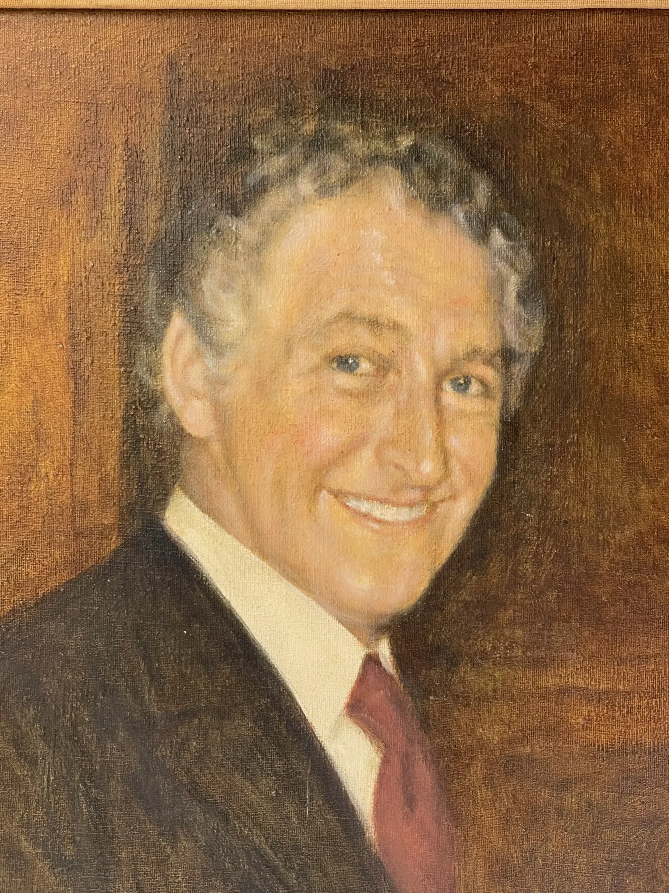

This is a story of my father, Nathan Ross — born Nathan Rothstein, a first generation citizen in
the New World (Canada) — as told through a chronology of some artifacts left behind: an oil portrait
of him hanging in my office painted by his cousin Norman Pelman, some photos, newspaper clippings,
concert programs, diplomas, an army discharge certificate, and a letter from a future President.

Piece by piece, these keepsakes trace a life that ran from child prodigy on a Vancouver stage,
to radio operator and gunner aboard a B-17 over Germany, to concertmaster's chair in Hollywood's
studio orchestras, to ... well, my dad. 

## Little Nacy

Before he was "Nathan Ross" he was just the littlest one in this portrait — the curly-haired boy
propped up on the table at left, flanked by his mother and older siblings in Vancouver.

The story goes that not long after this picture was taken, Nathan's father Max noticed him strumming
a rubber band stretched around a ruler and took this as a sign that he was meant to become a violinist.
Being a violinist himself, Max became Nathan's first teacher.

## Violinist

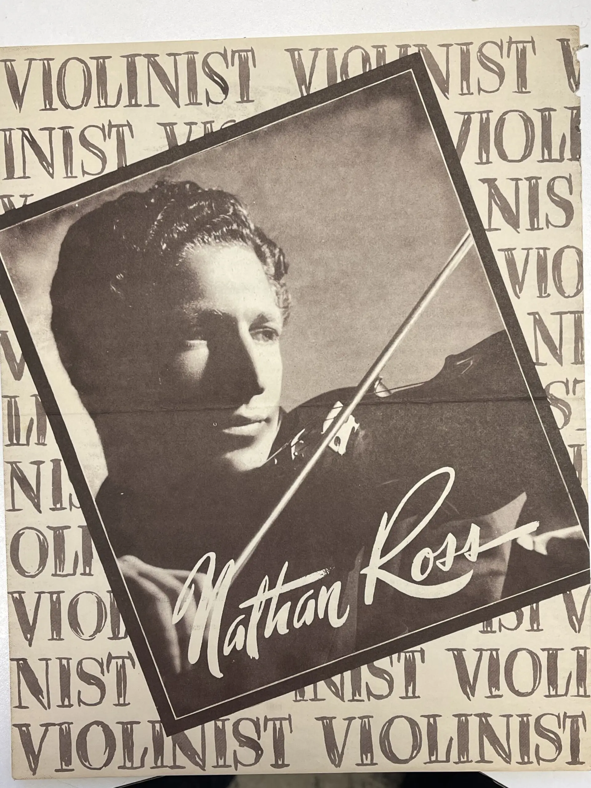

This photo showcases the outward-facing title role Nathan held the longest, and is the focus of many
of the artifacts here.

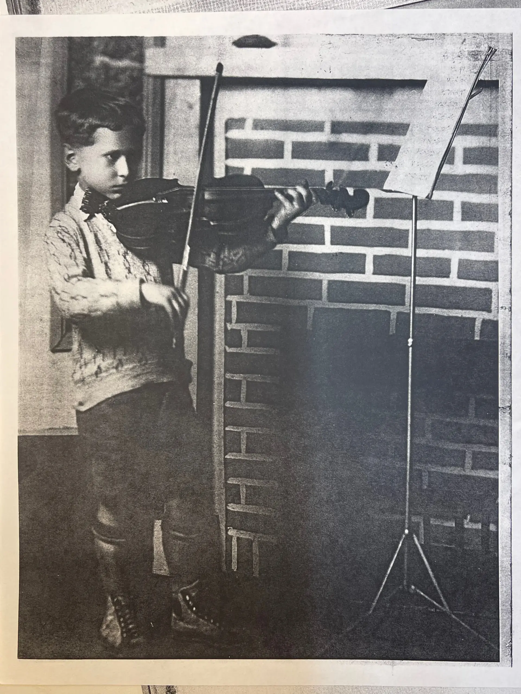

Nathan had already achieved some mastery over his instrument by the time this portrait was taken. 

He made his concert debut at age six at the British Columbia Musical Festival — winning first prize
for the most talented child under ten.

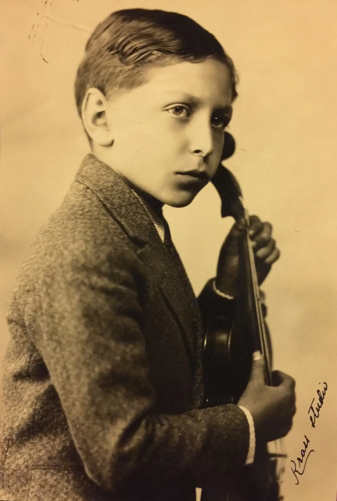

Four years after that first prize, the same Festival named Nathan its most talented competitor under
nineteen. By fourteen, he was no longer a novelty act — he had a real instrument, a real stance, and
the flower boutonnière of a young man being presented, not just exhibited.

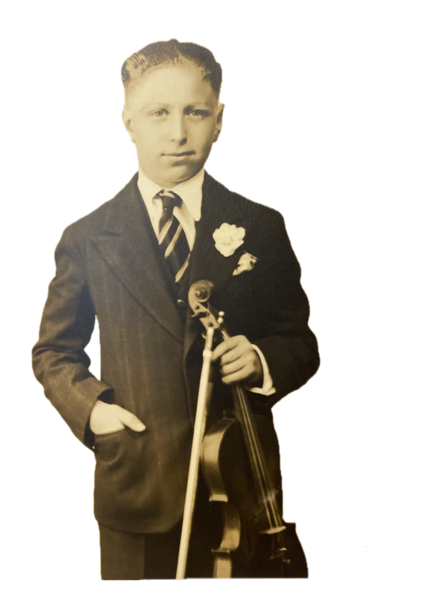

A critic's account of a solo recital that same year, at Kitsilano Junior High — the honest kind of
review, praising his "excellent elasticity in bowing" while also noting where the playing still
fell short. It's a useful corrective to the scrapbook instinct to keep only the raves: the family
kept this one too.

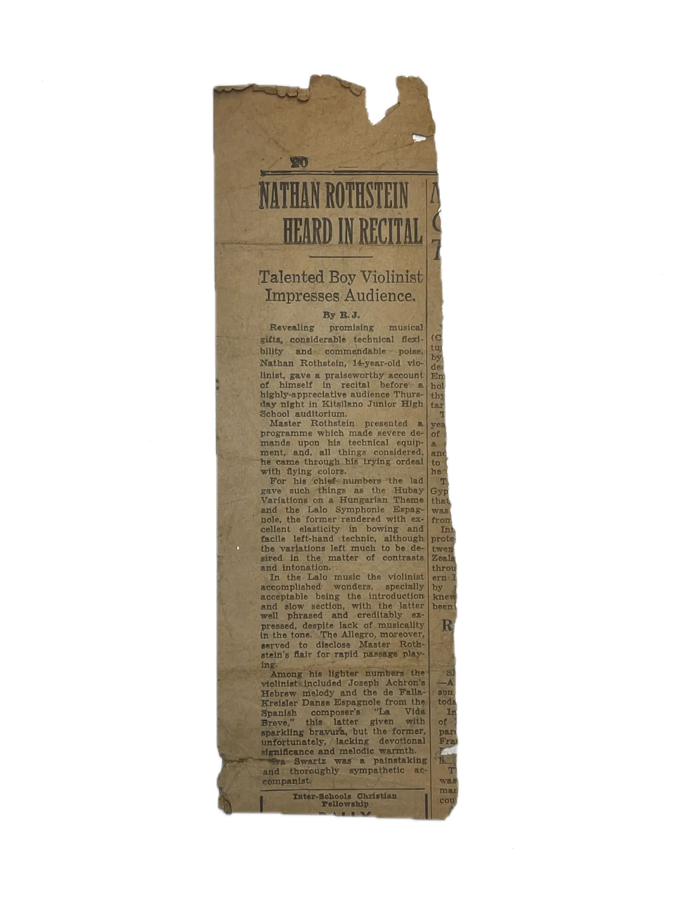

Shortly following the recital, a program note for a larger stage announces: "Nathan Rothstein, brilliant
boy violinist of Vancouver, will be the guest artist at the next concert of the Vancouver Symphony
orchestra in Stanley Park."

Another clipping from the same Stanley Park engagement. Vancouver's music community was small enough
that a fourteen-year-old's progress was news and thorough enough that the paper printed the pedigree.

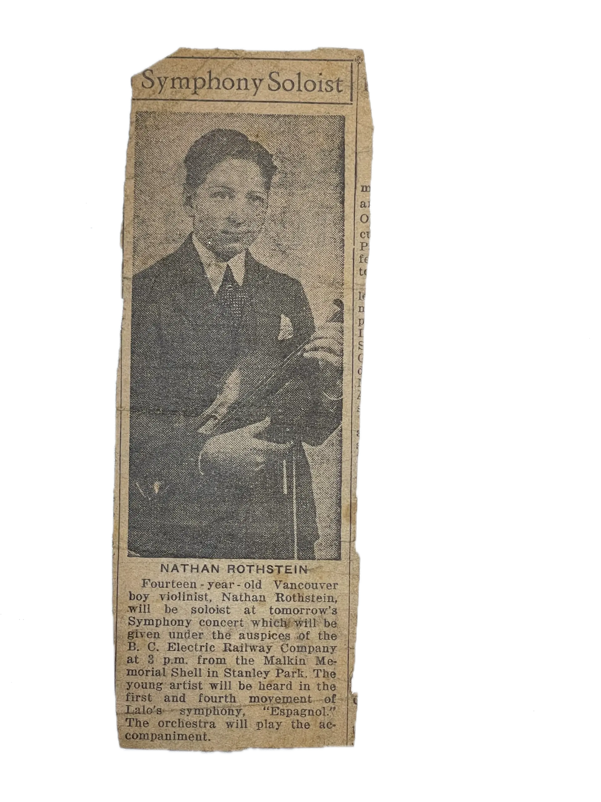

That concert proved to be a fortunate event for Nathan and represented a turning point in his musical
career.  [Isaac Stern](https://en.wikipedia.org/wiki/Isaac_Stern), another up-and-comining violinist,
was also present at that concert.  Isaac was so impressed with Nathan's playing that he put in a good
word to his teacher [Naoum Blinder](https://en.wikipedia.org/wiki/Naoum_Blinder), who extended a full
three-year scholarship to Nathan to come study with him in San Francisco.

- _BTW, while writing this, I thought to listen to the pieces he played both at the recital and in
  Stanley Park with the Vancouver Symphony.  I found a recording of Isaac playing the Lalo pieces on Apple Music
  [here](https://music.apple.com/us/album/symphonie-espagnole-in-d-minor-op-21-ii-scherzando/1563679982?i=1563680347)
  in case you want to hear it too._

So he went south at age 14 to live as a guest in the Stern residence in San Francisco.  Having the same
teachers, Isaac and Nathan practiced together and received formal education to the college entrance level
from private tutors.  To support himself, Nathan played violin with the San Francisco Symphony Orchestra.

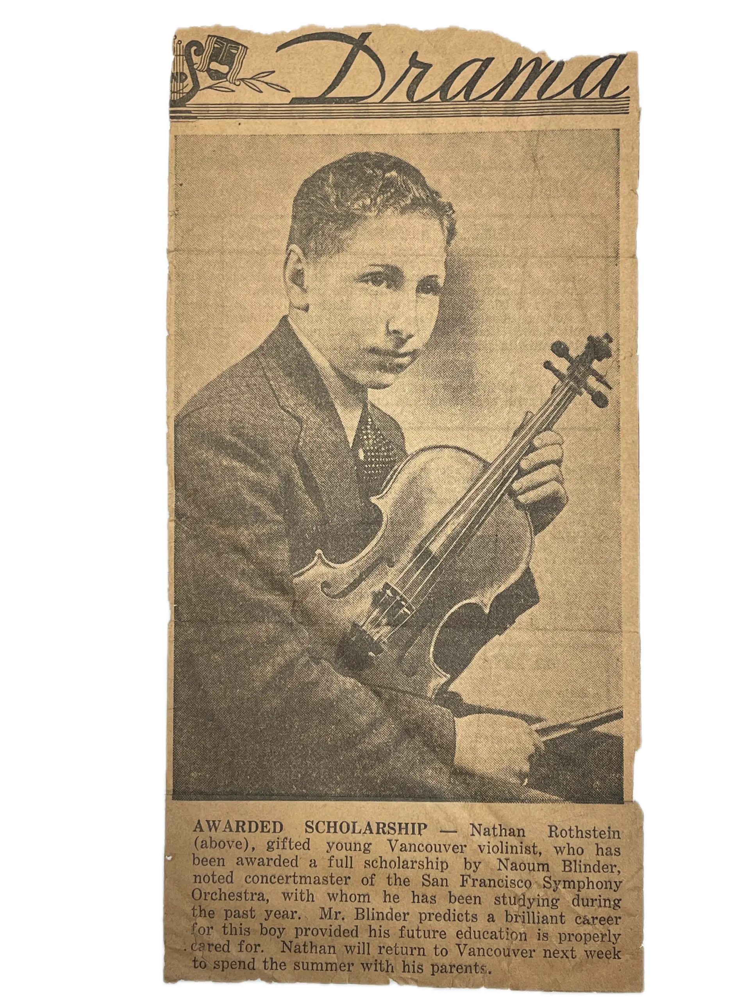

Though he returned periodically to Vancouver during his scholarship, it turned out that Nathan's move to
California was essentially permanent.  

## World War II

After the attack on Pearl Harbor, Nathan faced a brutal choice. He could sign an exemption from the
American draft, which would permanently bar him from citizenship and risk deportation. Alternatively,
he could return to Canada, a move that meant relinquishing his budding footing in the American classical
music scene to face mandatory enlistment in the Canadian draft.

So, Nathan took control of his fate.  Under wartime law, foreign nationals who honorably served in 
the U.S. Armed Forces were granted a streamlined, rapid pathway to American citizenship.

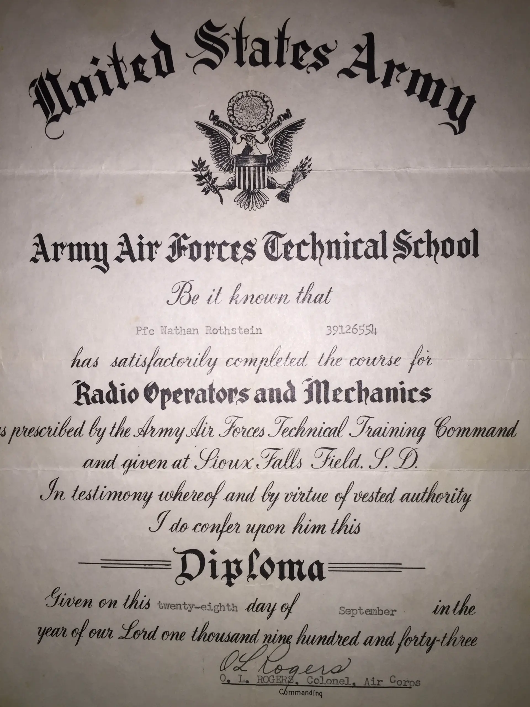

As evidenced in the diploma from Army Air Forces Technical School at Sioux Falls Field, South
Dakota, "Pfc Nathan Rothstein" received training as a Radio Operator / Mechanic.  This training set
him up as the radio operator / machine gunner in a B-17 bomber over Germany less than a year later.

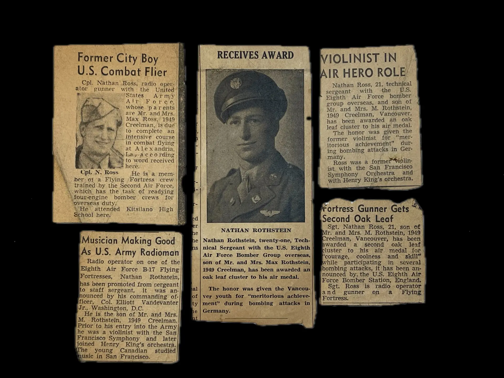

I've always found it enigmatic that my father chose to interrupt his career so totally and at such risk
to his own life. My best explanation is for a foreign national living as a guest, the psychological need
to "prove" one's loyalty to an adopted home and peers (and maybe one's self?) would have been overwhelming.
Enlisting in a highly dangerous, combat-heavy role was the ultimate statement of assimilation and bravery.

Nathan stood at a crossroads where his scholarship had ended, his legal status in America was precarious,
and a global war had shattered normal life.  To protect his dream of an American future, avoid the stigma
of being a "draft dodger," and perhaps caught up in the romantic patriotism of the era, he chose the ultimate
test of courage. He didn't just accept citizenship; he paid for it in the freezing, thin air over Germany,
surviving 35 missions in a glass box target.  It was an incredibly dangerous path, but it speaks clearly
of Nathan's resolve: he was a man willing to risk everything to secure the life, the citizenship, and the
future career he wanted.

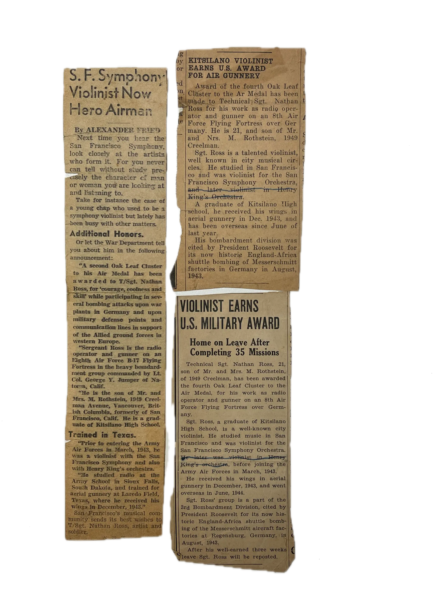
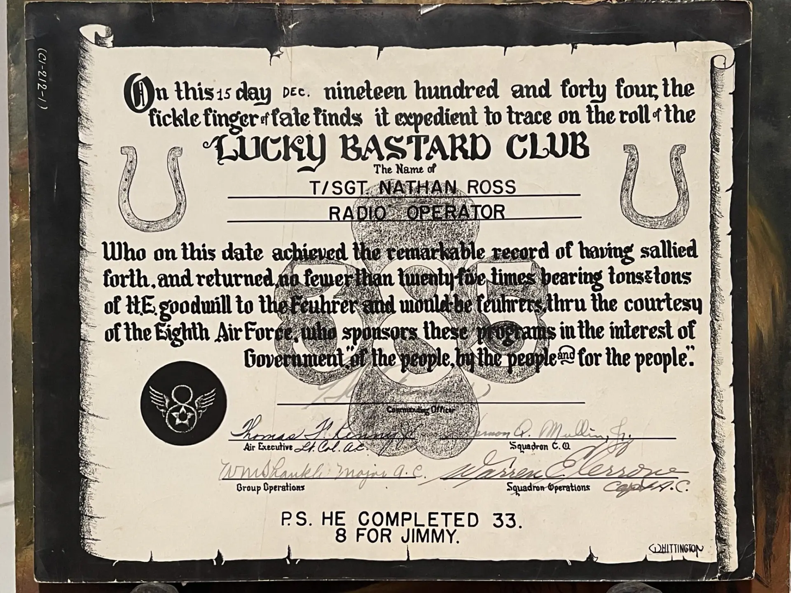

By the time these clippings ran, Nathan's life looked quite different.  He had not only participated in,
but had _survived_ dozens of live combat missions over Germany, had been awarded an Air Medal for courage,
earned his path towards naturalization as a U.S. Citizen, and also legally changed his surname to "Ross"
(less jewish-sounding) on the advice of Mr. Blinder towards his future career in Hollywood.

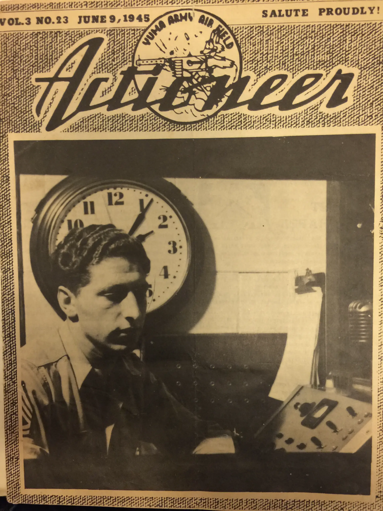
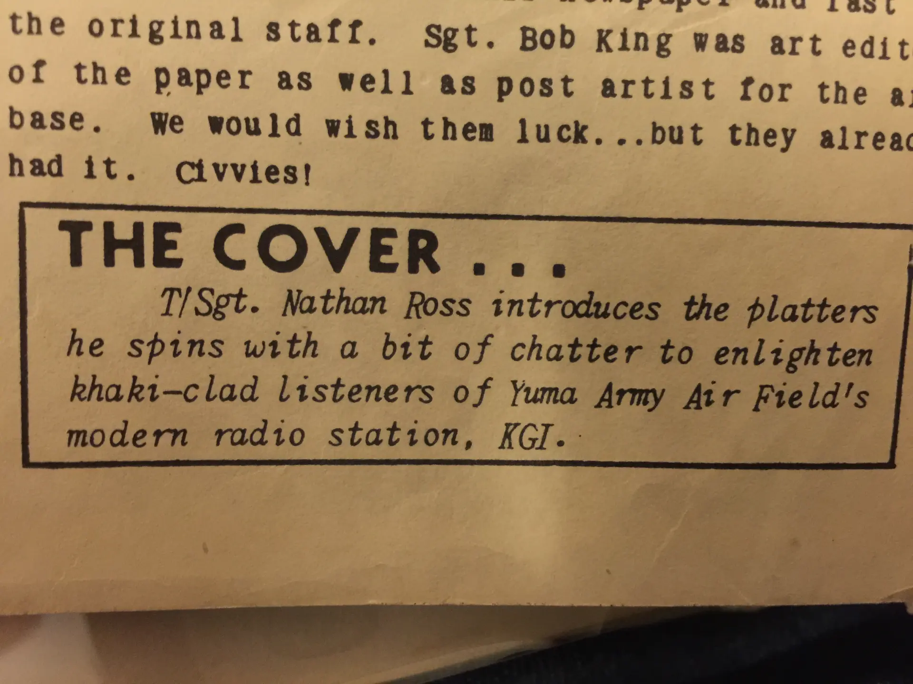

The cover of the *Airfoneer*, the base newspaper of Yuma Army Air Field, June 1945 — with T/Sgt.
Nathan Ross on the front, headphones on, introducing records over the base's radio station, KGI.
The violinist's ear and the entertainer's instinct didn't go to waste in uniform; even between
combat postings, he ended up back in front of a microphone.

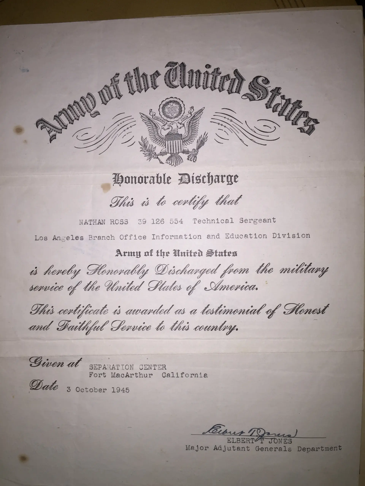

And the discharge itself: Fort MacArthur, California, October 3, 1945 — "awarded as a testimonial
of Honest and Faithful Service to this country." The war was over, and so, for Nathan Ross, was
the Army. 

## Los Angeles

Nathan resumed his career as a classical violinist in his postwar re-entry into professional life.
His first few roles included first violinist for the Los Angeles Philharmonic under Alfred Wallenstein,
and concert master for the NBC Symphony Orchestra under Henry Russel.

What came next was building a new life in a city he hadn't grown up in, among people he hadn't yet met.

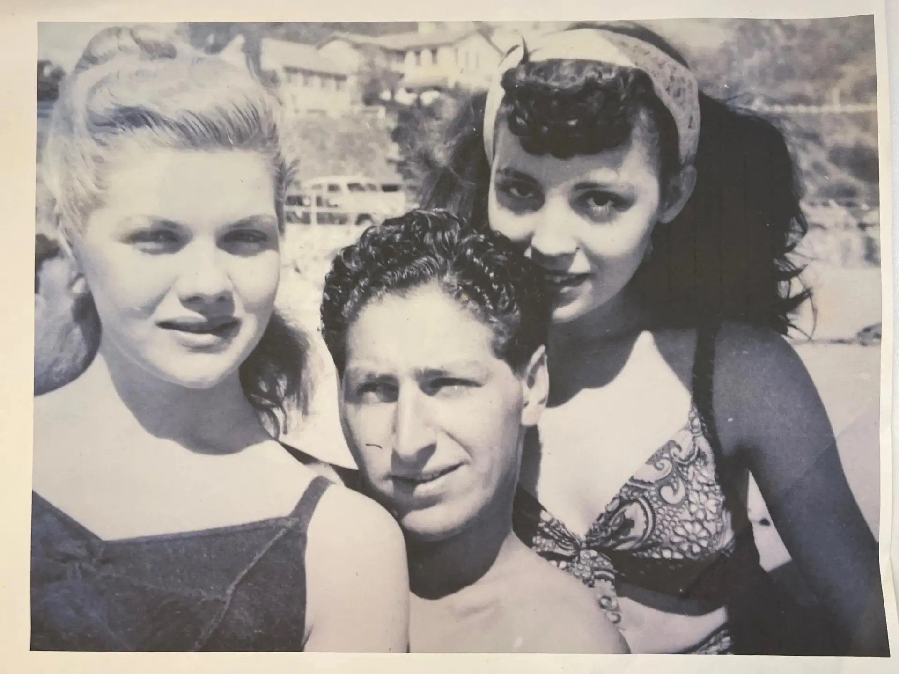

A mutual friend, playing matchmaker, intentionally brought my parents together by organizing a beach outing
for them. You can see the two of them on the right side of this photograph, standing less than a mile
from where they would eventually settle down to raise our family.

They hit it off at that meeting on the beach.  Because they traveled in Hollywood circles (as my to-be mom
was a fashion model), we have pictures of them together in fashionable places such as this one.

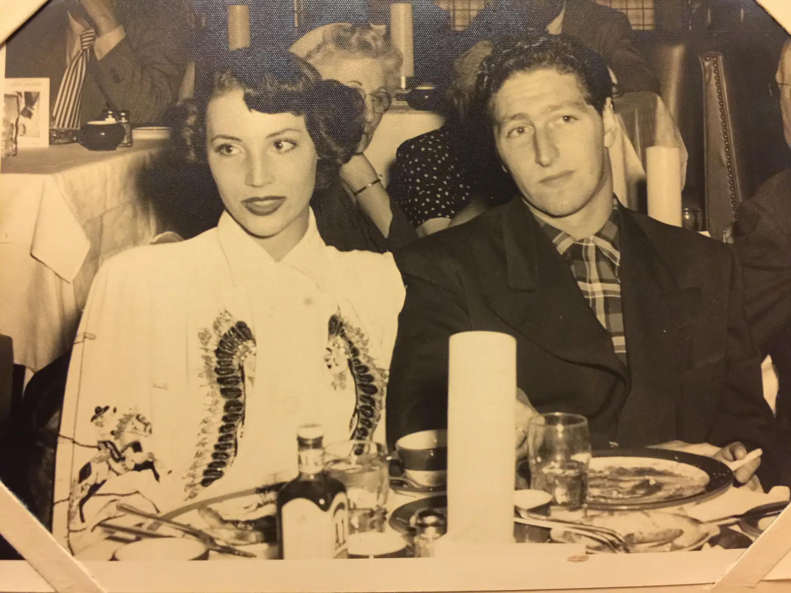

## Postwar Homecoming

After dating my future mother for a while, Nathan returned to Vancouver to visit his family and was
welcomed in a hero's homecoming.

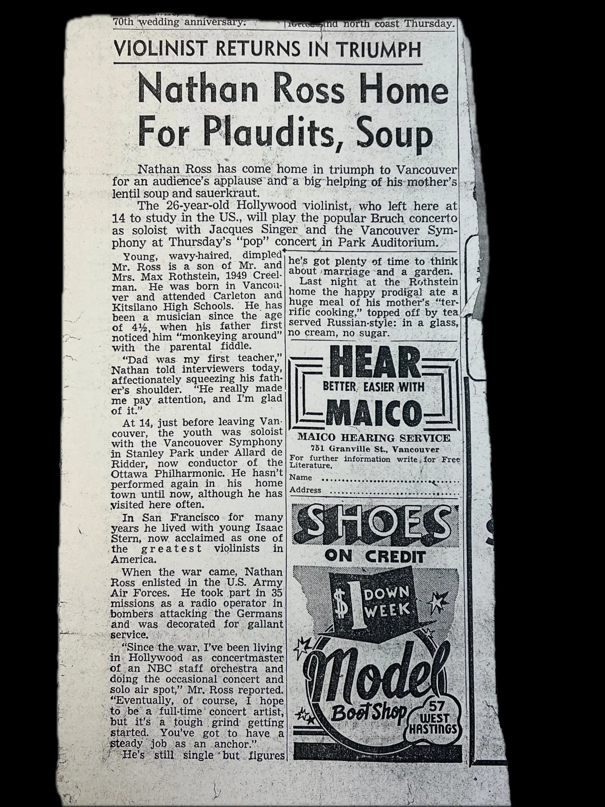

Billed as an "outstanding American violinist of the San Francisco Orchestra," he performed as guest
soloist with the Vancouver Symphony under Jacques Singer, playing the Bruch G-minor Concerto. The
critic who'd covered him as a boy was still there to cover him as a man: "From a very stocky little
boy he has grown into a handsome young man nearly six feet in height."

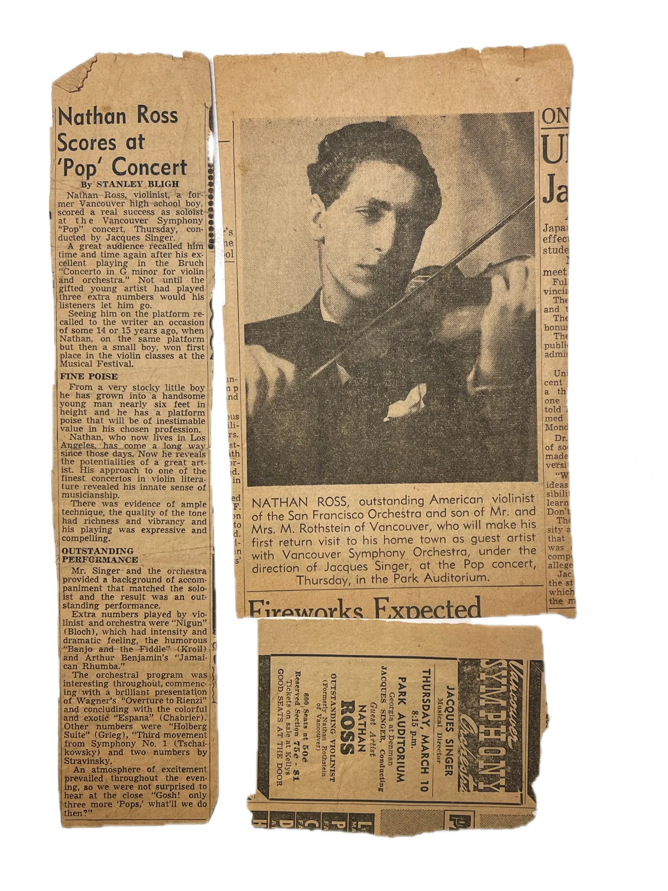
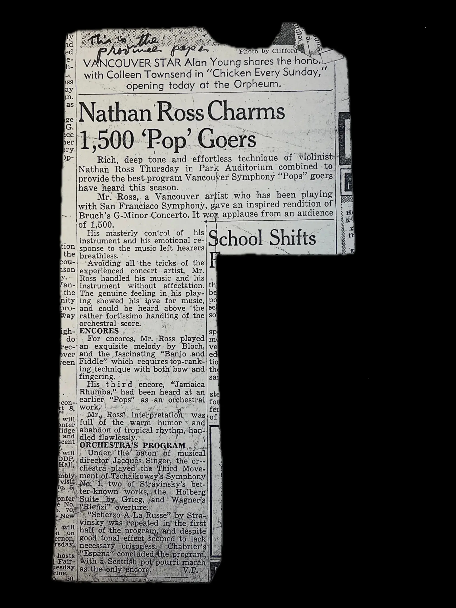

Towards the end of his visit in the town he grew up in, Nathan faced another personal dilemma.
You can read his own words about his heartfelt identity crisis in
[the letter to his future wife](../static/nathan-ross/images/1948-jul31-letter-to-anne.pdf).

The long trip home gave Nathan the time he needed to reflect. By the time he returned to Hollywood,
his mind was made up: he was going to marry my mother. Both of them were rebels in their own families,
choosing to follow their hearts rather than bow to the expectations and preplanned futures their parents
had laid out for them.

After his parents learned of — and learned to accept — the marriage, Nathan's dad wrote him
[this touching letter](../static/nathan-ross/images/1950-april4-letter-from-max.pdf)
which I find to be incredibly heartwarming and validating for my own sake.

## Hollywood Here we Come!

The fullest single account of Nathan's career appears here, written when he was twenty-seven and
concertmaster of the NBC Symphony Orchestra in Los Angeles: the father who first taught him, the
child prodigy years, the Blinder scholarship and the friendship with Stern, the B-17 bombing
missions over Germany, and — after the war — first violinist with the Los Angeles Philharmonic
under Alfred Wallenstein, then, a year later, the NBC concertmaster post itself.

- _[Listen to the Bekins Orchestra Radio clip](https://pub-cade15fc7c0b4b1da577523fe86c83c7.r2.dev/bekins-full-broadcast-mono.m4a)_

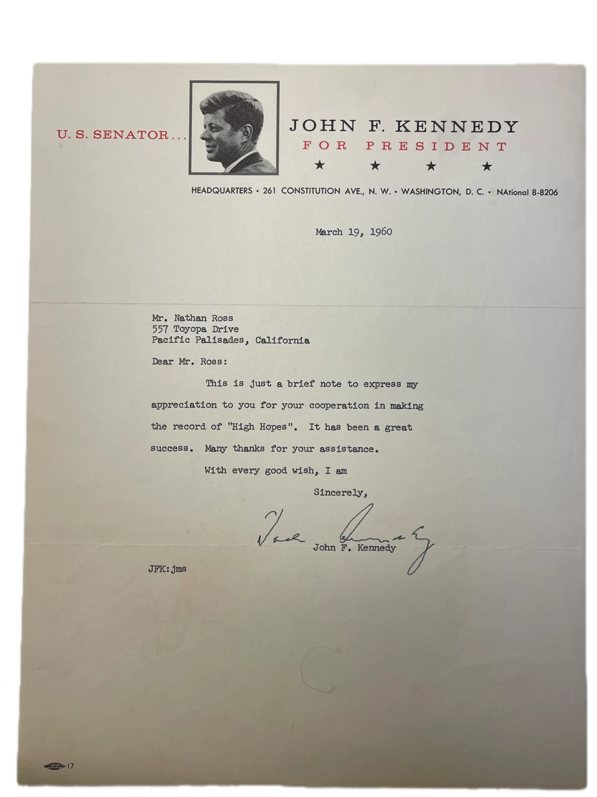

Here's a letter dated March 19, 1960, on "John F. Kennedy for President" letterhead, thanking Nathan Ross
for his help making the recording of "High Hopes," Frank Sinatra's Kennedy campaign anthem. A small, specific
window into the studio-musician life the NBC biography only gestured at: this is what "concertmaster of the NBC
Symphony" turned into, day to day, in Los Angeles session work.

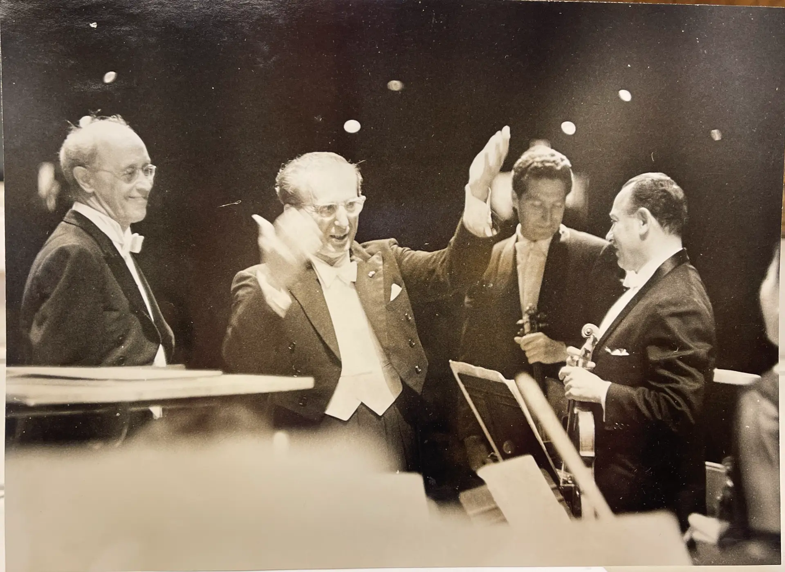

I thought this was a cool picture, so I decided to include it.  However, I have no idea where it
was taken or who is in it besides Nathan.  If you can identify these folks, please let me know!

## Studio Recordings

There were a number of factors that influenced Nathan's decision to join the recording industry in 
Los Angeles instead of continuing to pursue concertizing and staying in the classical music scene.

First, the war interrupted his prime time to "launch" his solo career.  After the war, he was older
than the typical "up-and-coming young artist" and by this time had nobody to sponsor (finance) the
necessary concert tour of Europe.  Mostly though (according to my mom), "Nathan was so thankful to
come through the war alive and unmaimed that he just wanted a simple, regular home and family life,
free of the stresses of constant travel and career pressures."

- [Listen to some well-known recordings in which Nathan Ross played violin](https://noodnik2.github.io/music-session-explorer/#/?artist=Nathan+Ross)

## Continuing in The Classical Music Scene

As much as Nathan enjoyed the predictability and the relatively high pay and other benefits of working
primarily in the recording industry, most often for popular artists, he didn't always like the music he
was playing there.  I remember he would come home often and ask us to "turn down that music – it's what
I hear in my headphones all day at work!"

Nathan was able to continue performing and enjoying his connection to classical music through intimate
chamber music gatherings both at our house and at nearby colleagues' homes; or by filling in when needed
in the Los Angeles Philharmonic; or by participating in various local classical organizations such as the
[Los Angeles Baroque Players](https://cdnc.ucr.edu/?a=d&d=BMTN19630116.1.5&e=-------en--20--1--txt-txIN--------),
the Los Angeles County Museum Chamber Music Society, the Southern California Chamber Music Society,
the Musical Arts Society of LaJolla, and others.

I fondly remember family trips abroad to watch my dad perform in famous venues.  If I'm not mistaken,
an example of this is when we watched him playing at 
[La Scala](https://www.teatroallascala.org/en)
and the
[Royal Albert Hall](https://www.royalalberthall.com/) during the L.A. Philharmonic's "European tour in 1974", as described in the
[Six Decades of Zubin Metha](https://www.laphil.com/posts/six-decades-of-zubin-mehta).

One of my favorite recordings of Nathan's is one my mother taped from a radio broadcast of Chausson's _Concert for
Violin, Piano, and String Quartet_ (Op. 21) at the Los Angeles County Museum of Art. I'm happy to have found the
cassette and been able to digitize and upload it; click the link to hear it:

- [Listen to L.A. County Museum Concert: Chausson Concerto Op. 21](https://pub-cade15fc7c0b4b1da577523fe86c83c7.r2.dev/chausson-concerto-op21.m4a)

## Obituary

Nathan had a lot of dental work during his life and had many fillings.  While servicing one of those fillings in
the early 1980s, a suspicious infection was found by the dentist and later confirmed to be from a malignancy.

An aggressive form of small-cell cancer eventually led to his rapid deterioration and untimely death in 1984.

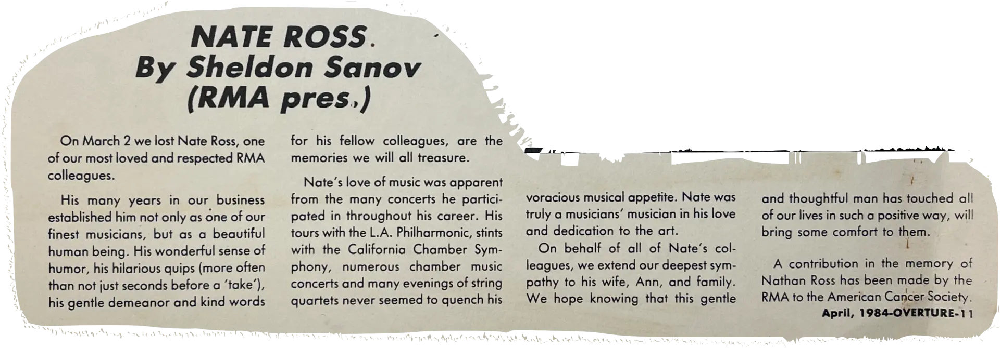

And the close of the story, in the words of a colleague rather than his own: Sheldon Sanov's tribute in the
Recording Musicians Association newsletter, marking Nathan's death on March 2, 1984. "Nate was truly a
musicians' musician in his love and dedication to the art."

